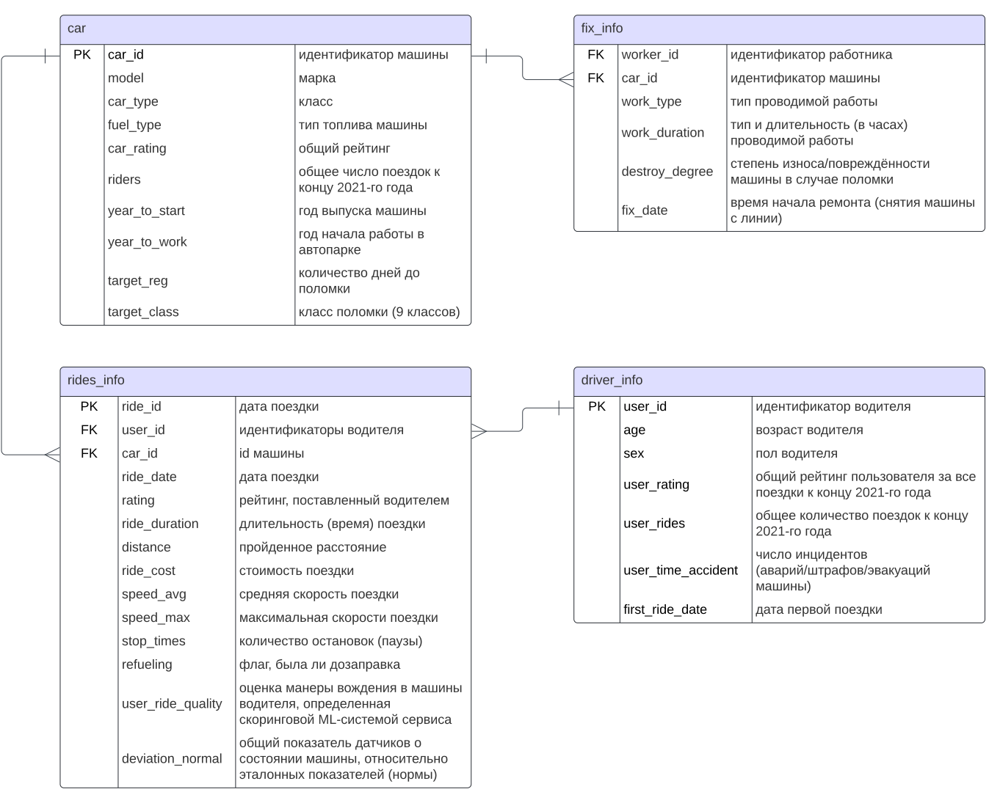

# competitive_ds_cource_prj

Проект для курса [Введение в соревновательный Data Science](https://stepik.org/course/108888/info) на [Stepic](https://stepik.org/).

## Краткое описание

Для оптимизации расходов на ремонт и техническое обслуживание обслуживание автомобилей каршеринговой компании необходима модель, которая будет прогнозировать, время через которое произойдёт поломка и класс поломки.

**Цель** - построить модель, прогнозирующую время, через которое произойдёт поломка, и класс поломки.

**Целевые метрики**:
1. **ROC AUC** - для прогнозирования класса поломки (классификация)
2. **RMSLE** - для прогнозирования времени до поломки (регрессия)
$$RMSLE = \sqrt{ \frac{1}{n} \sum_{i=1}^n \left(\log (1 + \hat{y}_i) - \log (1 + y_i)\right)^2},$$  
где  
$n$ - количество наблюдений,  
$\hat{y}_i$ значение, спрогнозированное моделью для наблюдения $i$,  
$y_i$ - фактическое значение для наблюдения $i$,  
$\log$ - натуральный логарифм.

## Описание данных

### Основная информация

Данные состоят из несколько их файлов. Описание машин и информация о поломках собраны в следующих:
- [`car_train.csv`](https://raw.githubusercontent.com/a-milenkin/Competitive_Data_Science/main/data/car_train.csv) - данные для обучения моделей;
- [`car_test.csv`](https://raw.githubusercontent.com/a-milenkin/Competitive_Data_Science/main/data/car_test.csv) - данные для подготовки прогноза для соревнования;

Опписание столбцов из `car_train.csv`, `car_test.csv`:
- `car_id` - идентификатор машины;
- `model` - марка;
- `car_type` - класс;
- `fuel_type` - тип топлива машины;
- `car_rating` - общий рейтинг;
- `riders` - общее число поездок к концу 2021-го года;
- `year_to_start` - год выпуска машины;
- `year_to_work` - год начала работы в автопарке;
- `target_reg` - количество дней до поломки;
- `target_class` - класс поломки (9 классов).

### Дополнительная информация

Дополнительные данныесодержатся в следующих файлах:
- [`rides_info.csv`](https://raw.githubusercontent.com/a-milenkin/Competitive_Data_Science/main/data/rides_info.csv) - информация про поездки;
- [`driver_info.csv`](https://raw.githubusercontent.com/a-milenkin/Competitive_Data_Science/main/data/driver_info.csv) - информация про водителей;
- [`fix_info.csv`](https://raw.githubusercontent.com/a-milenkin/Competitive_Data_Science/main/data/fix_info.csv) - информация о ремонтах машин.

Описание столбцов `rides_info.csv`:
- `user_id` - идентификаторы водителя;
- `car_id` - id машины;
- `ride_id` - id поездки;
- `ride_date` - дата поездки;
- `rating` - рейтинг, поставленный водителем;
- `ride_duration` - длительность (время) поездки; 
- `distance` - пройденное расстояние;
- `ride_cost` - стоимость поездки;
- `speed_avg` - средняя скорость поездки;
- `speed_max` - максимальная скорости поездки;
- `stop_times` - количество остановок (паузы);
- `refueling` - флаг, была ли дозаправка;
- `user_ride_quality` - оценка манеры вождения в машины водителя, определенная скоринговой ML-системой сервиса;
- `deviation_normal` - общий показатель датчиков о состоянии машины, относительно эталонных показателей (нормы). 

Описание столбцов `driver_info.csv`:
- `user_id` - идентификатор водителя;
- `age` - возраст водителя;
- `sex` - пол водителя;
- `user_rating` - общий рейтинг пользователя за все поездки к концу 2021-го года;
- `user_rides` - общее количество поездок к концу 2021-го года;
- `user_time_accident` - число инцидентов (аварий/штрафов/эвакуаций машины);  
- `first_ride_date` - дата первой поездки.

Описание столбцов `fix_info.csv`:
- `worker_id` - идентификатор работника;
- `car_id` - идентификатор машины;
- `work_type` - тип проводимой работы;
- `work_duration` - тип и длительность (в часах) проводимой работы;
- `destroy_degree` - степень износа/повреждённости машины в случае поломки;
- `fix_date` - время начала ремонта (снятия машины с линии).
  
### Схема данных

## Структура репозитория

    ├── comp_ds_prj                   <- Каталог с исходным кодами проекта. __init__.py делает из каталога пакет Python.
    │   ├── data                      <- Скрипты для загрузки и обработки данных.
    │   │   └── combine_data.py
    │   ├── features                  <- Скрипты создающие из сырых данных признаки, пригодные для передачи модели.
    │   │   └── build_features.py
    │   ├── logs                      <- Каталог с модулями для организации и настройки логирования.
    │   │   └── logs.py
    │   ├── models                    <- Модули, реализующие работу с разными моделями. Для каждой модели свой модуль.
    │   │   └── model_catboost.py
    │   └── visualization             <- Скрипты для генерации графиков.
    │       └── visualize.py
    |
    ├── data
    │   ├── external                  <- Данные, полученные из внешних источников, например открытых API в интернете.
    │   ├── interim                   <- Промежуточные данные, полученные после предобработки сырх данных и данных из
    |   |                                внешних источников, а также данные, полученные после промежуточных шагов обработки.
    │   ├── processed                 <- Подготовленные данные, пригодные для передачи модели.
    │   ├── raw                       <- Сырые исходные данные, полученные из первоисточника.
    │   └── submissions               <- Прогнозы (сабмиты) для отправки на Kaggle.
    |
    ├── docs                          <- Документация проекта.
    │   └── figures                   <- Иллюстрации для документации.
    |
    ├── .dvc                          <- Временные файлы и настройки DVC, в том числе и данные для доступа ко внешнему 
    |                                    хранилищу.
    │   ├── config                    <- Глобальные настройки.
    │   └── config.local              <- Локальные настройки.
    ├── .gdrive
    │   └── credentials.json          <- Токен для подключения DVC к внешнему хранилищу данных на Google Drive.
    |
    ├── gh_actions_runner             <- Каталог со скриптами и файлами для работы с self-hosted runner GitHub Actions.
    │   ├── build_runner.sh           <- Скрипт, собирающий образ контейнера с ранером из Dockerfile.
    │   ├── Dockerfile                <- Dockerfile для сборки контейнера с ранером.
    │   ├── remove_runner.sh          <- Скрипт анулирует регистрацию ранера в GitHub Actions, что вызовет остановку
    |   |                                работающего ранера.
    │   ├── .secret_token             <- Временный токен для регистрации ранера в GitHub Actions. 
    │   └── start_runner.sh           <- Скрипт, создающий и запускающий контейнер с ранером. Скрип также регистрирует и
    |                                    запускает ранер.
    ├── .github
    │   └── workflows                 <- Каталог с описанием CI/CD конвейера GitHub Actions в формате yaml.
    │       └── test_and_lint.yaml
    |
    ├── logs                          <- Каталог для логов.
    |
    ├── models                        <- Каталог с сохранёнными обученными моделями.
    |
    ├── notebooks                     <- Каталог с тетрадками Jupyter
    │   ├── exploratory               <- Notebook-и с первичными исследованиями и экспериментами. 
    |   |                                В них допустимо большое количество кода.
    │   └── reports                   <- Более тщательно оформленные тетрадки, служащие основой для отчётов.
    |
    ├── references                    <- Дополнительные сторонние материалы и руководства.
    │   └── baseline_by_authors.ipynb <- Baseline-решение от авторов [курса](https://stepik.org/course/108888/info).
    |
    ├── reports                       <- Каталог с отчётами. Отчёты содержат информацию об основных этапах исследования,
    |                                    разработке модели и их результатах. Для остальных разделов, например описания
    |                                    окружения разработки и процесса его развёртывания есть документация (каталог docs).
    |
    ├── build.sh                      <- Скрипт собирающий образ контейнера с окружением разработки из Dockerfile.
    ├── Dockerfile                    <- Dockerfile с описанием контейнера со средой разработки.
    ├── .dockerignore                 <- Аналог .gitignore для Docker. Docker не будет копировать и обрабатывать всё, что
    |                                    перечислено в этом файле.
    ├── .dvcignore                    <- Аналог .gitignore для DVC. DVC не будет обрабатывать всё, что
    |                                    перечислено в этом файле.
    ├── dvc.lock                      <- Файл с метаданными о каждом шаге workflow, описанного в dvc.yaml и выполняемого
    |                                    DVC. Файл позволяет DVC определить какие шаги нужно выполнить.
    ├── dvc.yaml                      <- Описание workflow DVC в формате yaml.
    ├── .env                          <- Файл с переменными окружения, которые могут быть импортированы в среду разработки.
    ├── .flake8                       <- Файл с параметрами Flake8. Flake8 не поддерживает pyproject.toml, поэтому его
    |                                    параметры вынесены в отдельный файл.
    ├── .gitignore
    ├── jupyter.sh                    <- Скрипт для запуска контейнера среды разработки с запущенным сервером
    |                                    Jupyter Notebook.
    ├── LICENSE
    ├── poetry.lock                   <- Файл с зафиксированными зависимостями Poetry.
    ├── pyproject.toml                <- Файл с описанием пакетов, устанавливаемых в виртуальное окружение, и параметрами
    |                                    линтеров и автоформатеров.
    ├── README.md                     <- README.md верхнего уровня, отображащийся на заглавной странице репозитория.
    └── start.sh                      <- Скрипт для запуска контейнера среды разработки. Предоставляет доступ к /bin/bash
                                        в контейнере.
